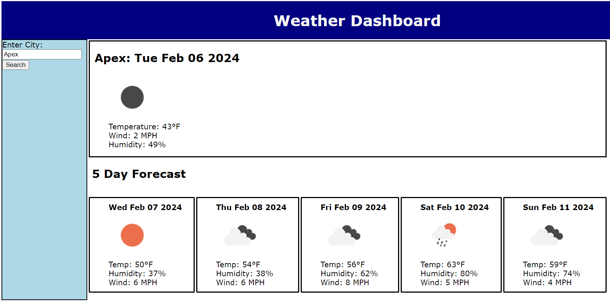

# Weather-Dashboard

## Description

This Weather Dashboard was created to provide the user with current and future weather conditions for a given city. The user types in a city name, clicks the Search button, and is presented with the current weather conditions and a five day forecast.

## Installation

N/A

## Usage

This Weather Dashboard was created to provide the user with information on current weather conditions, and a five day weather forecast for the user provided city.

## Credits

This project was created soley by me. The API used is the openweatherapi, and icons were sourced from the openweatherapi as well.

## License

N/A

## Screenshots

## Link to Webpage

https://wshearin3.github.io/Weather-Dashboard/